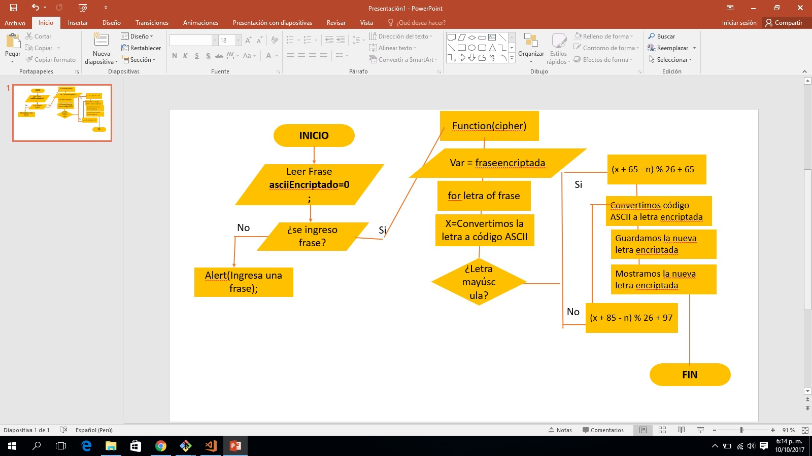

# Cifrado César

### Pseudocódigos:

#### Pseudocodigo Cifrado
    1. INICIO
    2. Ingresamos una "Frase"
    3. Inicializamos una variable donde almacenara temporalmente el codigo ASCII de cada letra
    4. Validamos si la Frase esta ingresada desarrollamos todo el proceso de la funcion cipher, despues la funcion decipher
      4.1. Crear una función de cifrado(Cipher)
        4.1.1. Inicializamos una variable donde se almacenara la frase encriptada
        4.1.2. Recorreremos o iteramos cada letra de la "frase"
            4.1.2.1. Convertiremos y alamacenamos cada letra de la frase ingresada a código Ascci
        
        4.1.3. Condicionamos para que la frase almacenada este en el rango de numeros ASCII y no de otros
        
        4.1.4. Validaremos si cada letra de la frase es mayúscula 
                4.1.4.1 Si la letra iterada es MAYÚSCULA Aplicaremos:
                   - Si i= MAYUSCULA => (x-65+n)%26+65
                4.1.4.2 S Si la letra es minúscula Aplicaremos
                  - Si i= minuscula => (x-97+n)%26+97
            
            4.1.2.2. Convertiremos el codigo ASCII encriptado a letra
        4.1.2.Una vez obtenido las nuevas letras encriptadas guardaremos en la primera variable que inicializamos
        4.1.3.1. Si la frase ingresada contiene numeros enviar una advertencia "La frase ingresada contiene números"
        4.1.1.1. Guardamos la letra convertida en una nueva variable
        4.1.1.2. Mostramos nuestra nueva frase encriptada

     4.2. Crear una función de descifrado(deCipher)
        4.2.1. Inicializamos una variable donde se almacenara la frase encriptada
        4.2.2. Recorreremos o iteramos cada letra de la "frase"
            4.2.2.1. Convertiremos y alamacenamos cada letra de la frase ingresada a código Ascci
        
        4.2.3. Condicionamos para que la frase almacenada este en el rango de numeros ASCII y no de otros
        
        4.2.4. Validaremos si cada letra de la frase es mayúscula 
                4.1.4.1 Si la letra iterada es MAYÚSCULA Aplicaremos:
                   - Si i= MAYUSCULA => (x + 65 - n) % 26 + 65 
                4.1.4.2 S Si la letra es minúscula Aplicaremos
                  - Si i= minuscula => (x + 85 - n) % 26 + 97  
            
            4.2.2.2. Convertiremos el codigo ASCII encriptado a letra
        4.2.2.Una vez obtenido las nuevas letras encriptadas guardaremos en la primera variable que inicializamos
        
        4.2.3.1. Si la frase ingresada contiene numeros enviar una advertencia "La frase ingresada contiene números"
        
        4.2.1.1. Guardamos la letra convertida en una nueva variable
        4.2.1.2. Mostramos nuestra nueva frase encriptada   
    5. FIN

### Diagrama de Flujo:

    