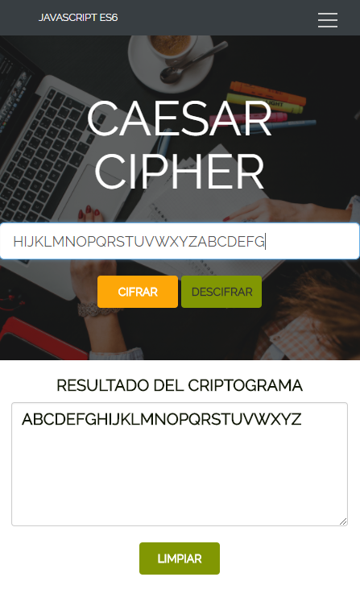
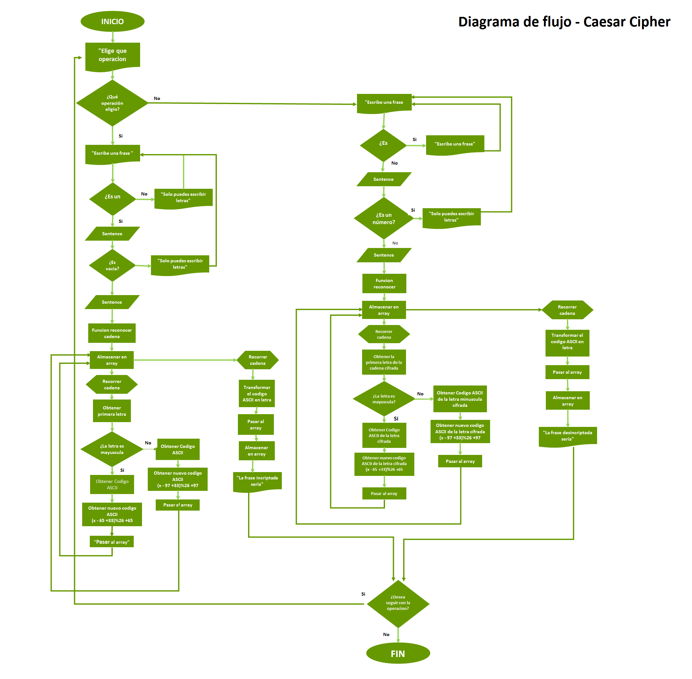

# CAESAR CIPHER ES6 

* **Tema:** _Práctica de conceptos - fundamentos de JS_
* **Unidad:** _Fundamentos de Javascript_

***

## Objetivos

* Pasar cifrado cesar de javascript 5 a ES6 manualmente.
* Actualizar la vista del cifrado cesar: Ingresar los datos mediante un input y un botón que ejecute la función, el resultado se debe mostrar en la pantalla.
 
## Tecnologías - Herramientas

* Bootstrap
* Html5
* Css3
* Javascript
* ES6

## PRODUCTO FINAL

#### VERSIÓN WEB 

* Vista desde la ventana del navegador desktop a medida se haga más pequeña.

#### VERSIÓN MOVIL

* Vista desde la ventana del navegador móvil a medida se haga más pequeña.

## Diagrama de Flujo:

Representación del proceso de funcionamiento mediante un diagrama de flujo:

## Autora:

* Pamela De la cruz Lozano

## Fecha: 
24/01/2018
    